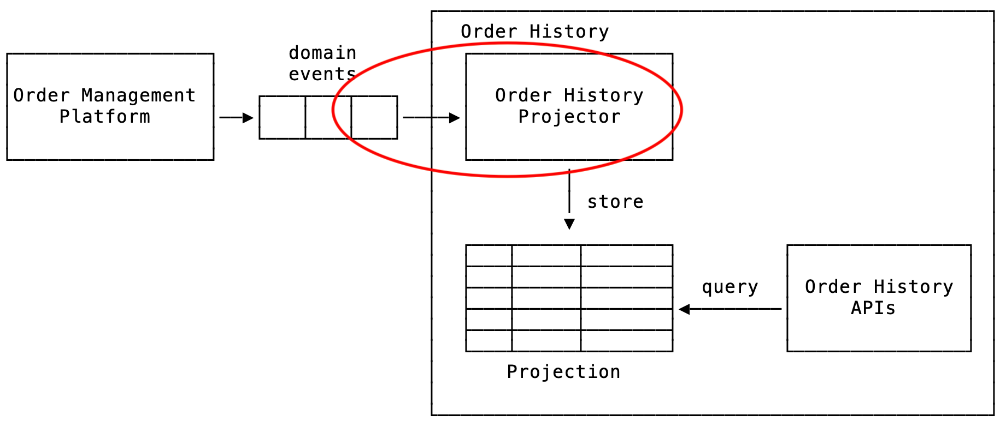
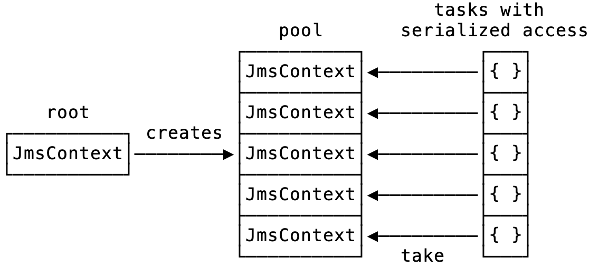

autoscale: true

## How to turn an API into Functional Programming

### _Lessons learned while filling the gap_

---

# Who am I?
## _@al333z_

- Senior Software Engineer @ Moneyfarm
- Several years in the scala/typelevel ecosystem
- Member of _@FPinBO_ 
- I like to run


---

# Why this talk?

### _Functional Programming is great, but..._

- not all the languages are born this way
- lot of libs/apis which are just __not designed with FP in mind__
- one may argue that FP is __not suited__ for all the use cases

---

# Agenda

- a sample architecture, a reference library to wrap
- designing library apis
  - introduce a bunch of building blocks
  - refine edges, evaluate alternatives, iterate

---

## A sample architecture


---

## A sample architecture



---

## Disclaimer

Our focus here is **_NOT_** on building the coolest library doing the coolest thing ever.

Chances are that you'll never use JMS at all!

We'll just put our attention on **_designing a set of APIs_** which wraps an existing lib written in the _good old imperative way_, using Pure Functional Programming and the Typelevel stack.

---

## A reference library

__Java Message Service__ a.k.a. JMS

- provides generic messaging models
- able to handle the producer–consumer problem
- can be used to facilitate the sending and receiving of messages between enterprise software systems, whatever it means enterprise!

---
## JMS main elements

- __Provider__: an implementation of JMS (ActiveMQ, IBM MQ, RabbitMQ, etc...)
- __Producer__/__Publisher__: a client that creates/sends messages
- __Consumer__/__Subscriber__: a client that receives messages
- __Message__: an object that contains the data being transferred
- __Queue__: a buffer that contains messages sent and waiting to be read
- __Topic__: a mechanism for sending messages that are potentialy delivered to multiple subscribers

---

## Why JMS?

- ~~old~~ stable enough (born in 1998, latest revision in 2015)
- its apis are a __good testbed for sketching a purely functional wrapper__
  - loads of state, side-effects, exceptions, ...
- found pretty much nothing about (no FP-like bindings...)
- I don't like suffering to much while working

---

# Let's start
## with a bottom-up approach

---

## A look at the beast: receiving

```java
public void receiveMessage(ConnectionFactory connectionFactory, String queueName){
   try (
     JMSContext context = connectionFactory.createContext(Session.SESSION_TRANSACTED);
   ){
      Queue queue = context.createQueue(queueName);
      JMSConsumer consumer = context.createConsumer(queue);
      Message msg = consumer.receive();
      // ... do something useful ...
      context.commit();
   } catch (JMSRuntimeException ex) {
      // ...
   }
}
```

^ - `JMSContext` is in charge of _opening low level stuff_ (connections, sessions, ...), implements `AutoClosable` (see the try-with-resources block)
 `JMSConsumer` is in charge of receiving messages, via:
  - `Message receive()` will block indefinitely
  - `Message receive(long timeout)` will block up to a timeout
  - `Message receiveNoWait()` receives the next message if one is immediately available
  - other variants...
- In this usage of JMS we're using transacted sessions in order to explicitly commit or rollback the context (all the pending messages)
- `JMSRuntimeException` is an _unchecked exception_
  
---

<!--

# A look at the beast: destinations

```java
public interface Destination { }

public interface Queue extends Destination {
    String getQueueName() throws JMSException;
}

public interface Topic extends Destination {
    String getTopicName() throws JMSException;
}
```

A simple hierarchy...

---

# A look at the beast: messages

```java
public interface Message {
    String getStringProperty(String name) throws JMSException;
    void setStringProperty(String name, String value) throws JMSException;
    // ...
}

public interface TextMessage extends Message {
    void setText(String string) throws JMSException;
    String getText() throws JMSException;
    // ...
}
public interface BytesMessage extends Message { ... }
public interface MapMessage extends Message { ... }
public interface ObjectMessage extends Message { ... }
public interface StreamMessage extends Message { ... }
```

Another hierarchy with a set of common ops and type-specific ops

---
!-->

## A look at the beast

- JMS is really moooore than that
- For this session we'll just need to focus on this specific JMS functionality, which is what we need in order to satisfy our **business case**: 

> consuming from a queue, do something useful with each message, and either commit or rollback each message

---

## What's wrong with these APIs?

- __not__ really __composable__
- __*side-effects*__ everywhere
- __low-level__ in terms of how to build complete programs

---

## What can we do to improve them?

- **wrap** _side-effects_ and methods which throws
- understand what are the _core feature_ we want to expose
- evaluate what is the __design which better supports our intent__

---

## Our intent

- having all __effects__ explicitly marked in the types
- properly handle __resource__ acquisition/disposal (avoiding leaks!)
- __prevent__ the developer using our lib from doing __wrong things__ (e.g. unconfirmed messages, deadlocks, etc...) by design
- offering a __high-level__ set of APIs

---
<!--
# Destination

```java
public interface Destination { }

public interface Queue extends Destination {
    String getQueueName() throws JMSException;
}
// ...
```

- Concrete instances never gets created by the user of the lib
- They are always returned
- How to keep this invariant?

---

# Destination

```scala
sealed abstract class JmsDestination {
  private[lib] val wrapped: javax.jms.Destination
}

object JmsDestination {
  class JmsQueue private[lib] (private[lib] val wrapped: javax.jms.Queue) 
    extends JmsDestination
  // ...
}
```

- defining an _abstract class_ which __wraps__ and hides the java counterpart
- `private[lib]` will make sure users of the lib __can't access java counterparts__
- `sealed` will __close the domain__ to have only the defined possible concretions
- the constructor is private as well, only the lib can call it ✅

---

# Message

```java
public interface Message {
    String getStringProperty(String name) throws JMSException;
    void setStringProperty(String name, String value) throws JMSException;
    // ...
}

public interface TextMessage extends Message {
    void setText(String string) throws JMSException;
    String getText() throws JMSException;
    // ...
}
```

- A hierarchy of possible messages
- A set of _common operations_
- Other _type-specific_ operations

---

# Message

```scala
sealed class JmsMessage private[lib](private[lib] val wrapped: javax.jms.Message) {
  def tryAsJmsTextMessage: Try[JmsTextMessage] = wrapped match {
    case textMessage: javax.jms.TextMessage => Success(new JmsTextMessage(textMessage))
    // others...
    case _ => Failure(UnsupportedMessage(wrapped))
  }

  val getJMSMessageId: Option[String] = getOpt(wrapped.getJMSMessageID)
  val getJMSTimestamp: Option[Long]   = getOpt(wrapped.getJMSTimestamp)
  val getJMSType: Option[String]      = getOpt(wrapped.getJMSType)
  def getStringProperty(name: String): Option[String] = getOpt(wrapped.getStringProperty(name))

  def setJMSType(`type`: String): Try[Unit] = Try(wrapped.setJMSType(`type`))
  def setStringProperty(name: String, value: String): Try[Unit] = Try(wrapped.setStringProperty(name, value))

  private def getOpt[A](body: => A): Option[A] = // ...
}
```

- defining a _sealed class_ which __wraps and hides__ the java counterpart
- exposing a safer variant of its operations ✅

---

# Message

```scala
object JmsMessage {
  implicit val showJmsMessage: Show[JmsMessage] = Show.show[JmsMessage](/*...a sensible string representation...*/)

  case class UnsupportedMessage(message: javax.jms.Message)
    extends Exception("Unsupported Message: " + message.show) with NoStackTrace

  class JmsTextMessage private[lib](override private[lib] val wrapped: javax.jms.TextMessage) 
    extends JmsMessage(wrapped) {
    
    def setText(text: String): Try[Unit] = Try(wrapped.setText(text))
    val getText: Try[String]             = Try(wrapped.getText)
  }

  // ... other concretions ...
}
```

- implementing _all possible concretions_
- wrapping specific operations in order to catch exceptions ✅

---

# You may think this is boring and useless...

We just wrapped existing java classes

  - catching/wrapping side-effects
  - and exposing explicit effect types for failures/optionality
  
## Hold on...

---
-->

## Receiving

```java
public void receiveMessage(ConnectionFactory connectionFactory, String queueName){
   try (
     JMSContext context = connectionFactory.createContext(Session.SESSION_TRANSACTED);
   ){
      Queue queue = context.createQueue(queueName);
      JMSConsumer consumer = context.createConsumer(queue);
      Message msg = consumer.receive();
      // ... do something useful ...
      context.commit();
   } catch (JMSRuntimeException ex) {
      // ...
   }
}
```

- how to handle JMSRuntimeException?
- how to build a consumer that can be injected in our application components?
- how to handle the resource lifecycle?

---

# Let's see how FP con help us in doing the right thing!

---

# The abstraction gap


---

## Introducing IO
#### A data type for **encoding effects** as pure values

---

## Introducing IO

- enable capturing and controlling actions - a.k.a _effects_ - that your program _wishes to perform_ within a __*resource-safe*__, __*typed*__ context with seamless support for __*concurrency*__ and __*coordination*__
- these effects may be __*asynchronous*__ (callback-driven) or __*synchronous*__ (directly returning values); they may _return_ within microseconds or run __*infinitely*__.

---

## IO and combinators

[.column]

[.code-highlight: none]
[.code-highlight: 1-8]
[.code-highlight: all]

```scala
object IO {
  def delay[A](a: => A): IO[A]
  def pure[A](a: A): IO[A]
  def raiseError[A](e: Throwable): IO[A]
  def sleep(duration: FiniteDuration): IO[Unit]
  def async[A](k: /* ... */): IO[A]
  ...
}

class IO[A] {
  def map[B](f: A => B): IO[B]
  def flatMap[B](f: A => IO[B]): IO[B]
  def *>[B](fb: IO[B]): IO[B]
  ...
}
```

---

## Composing sequential effects

[.column]
[.code-highlight: 1-4]
[.code-highlight: 7-8]
[.code-highlight: 7-10]
[.code-highlight: 7-11]
[.code-highlight: 7-12]
[.code-highlight: all]

```scala
val ioInt: IO[Int] = 
  IO.delay { println("hello") }
    .map(_ => 1)

val program: IO[Unit] =
 for {
    i1 <- ioInt
    _  <- IO.sleep(i1.second)
    _  <- IO.raiseError( // not throwing!
            new RuntimeException("boom!")) 
    i2 <- ioInt //comps is short-circuted
 } yield ()
```
[.column]
[.code-highlight: none]
[.code-highlight: all]
```
> Output:
> hello
> <...1 second...>
> RuntimeException: boom!
```

---

[.background-color: #FFFFFF]

# How to fill the abstraction gap?


---

## JmsContext - 1st iteration

[.code-highlight: 1, 11]
[.code-highlight: 1-4, 11]
[.code-highlight: 1-11]
[.code-highlight: all]

```scala
sealed abstract class JmsContext(private[lib] val raw: javax.jms.JMSContext) {

  def createQueue(queue: QueueName): IO[JmsQueue] =
    IO.delay(new JmsQueue(raw.createQueue(queue.value)))

  def makeJmsConsumer(queueName: QueueName): IO[JmsMessageConsumer] =
    for {
      destination <- createQueue(queueName)
      consumer    <- IO.delay(raw.createConsumer(destination.wrapped))
    } yield new JmsMessageConsumer(consumer)
}

class JmsTransactedContext private[lib] (
  override private[lib] val raw: javax.jms.JMSContext) extends JmsContext(raw)
```

- handle JMSRuntimeException ✅
- build a consumer that can be injected in our application components ✅
- handle the resource lifecycle ❌ 

---

# How to handle the lifecycle of a resource?

---

## Introducing Resource

#### Effectfully allocates and releases a resource

---

## Extremely helpful to write code that:
- doesn't leak
- handles properly terminal signals (e.g. `SIGTERM`) by default (no need to register a shutdown hook)
- do _the right thing_<sup>TM</sup> by design
- avoid the need to reboot a container every once in a while :)

---

[.background-color: #FFFFFF]

# How to fill the abstraction gap?


---

[.code-highlight: 1-7]
[.code-highlight: 9-15]
[.code-highlight: all]

## Introducing Resource

```scala
object Resource {
  def make[A](
    acquire: IO[A])(
    release: A => IO[Unit]): Resource[A]
  def fromAutoCloseable[A <: AutoCloseable](
    acquire: IO[A]): Resource[A]
}

class Resource[A] {
  def use[B](f: A => IO[B]): IO[B]

  def map[B](f: A => B): Resource[B]
  def flatMap[B](f: A => Resource[B]): Resource[B]
  ...
}
```

[.footer: NB: not actual code, just a simplification sticking with IO type]
^ A note on the simplification

---

## Using a Resource

[.column]

[.code-highlight: 1-5]
[.code-highlight: all]

```scala
val sessionPool: Resource[MySessionPool] = 
  for {
    connection <- openConnection()
    sessions   <- openSessionPool(connection)
  } yield sessions

sessionPool.use { sessions =>
  // use sessions to do whatever things!
}
```

[.column]

[.code-highlight: none]
[.code-highlight: all]

```
Output:
> Acquiring connection
> Acquiring sessions
> Using sessions
> Releasing sessions
> Releasing connection
```

---

## Gotchas:
- **_Nested_ resources** are **released in reverse order** of acquisition 
- Every time you need to use something which implements `AutoClosable`, you should really be using `Resource`!
- You can _lift_ any `IO[A]` into a `Resource[A]` with a no-op release via `Resource.eval`

---

### Why not scala.util.Using?

- **not composable** (no `map`, `flatMap`, etc...)
- no support for properly handling effects

---

## JmsContext - 2nd iteration

[.code-highlight: 8-10]
[.code-highlight: 6-11]
[.code-highlight: all]

```scala
sealed abstract class JmsContext(private[lib] val raw: javax.jms.JMSContext) {

  def createQueue(queue: QueueName): IO[JmsQueue] =
    IO.delay(new JmsQueue(raw.createQueue(queue.value)))

  def makeJmsConsumer(queueName: QueueName): Resource[IO, JmsMessageConsumer] =
    for {
      destination <- Resource.eval(createQueue(queueName))
      consumer    <- Resource.fromAutoCloseable(
        IO.delay(raw.createConsumer(destination.wrapped)))
    } yield new JmsMessageConsumer(consumer)
}

class JmsTransactedContext private[lib] (
  override private[lib] val raw: javax.jms.JMSContext) extends JmsContext(raw)

```

- handle JMSRuntimeException ✅
- build a consumer that can be injected in our application components ✅
- handle the resource lifecycle ✅

---

## JmsMessageConsumer

[.code-highlight: 1-3, 12]
[.code-highlight: 4]
[.code-highlight: 4-6]
[.code-highlight: 4-10]
[.code-highlight: all]

```scala 
class JmsMessageConsumer private[lib] (
  private[lib] val wrapped: javax.jms.JMSConsumer
) {
  val receive: IO[JmsMessage] =
    for {
      recOpt <- IO.delay(Option(wrapped.receiveNoWait()))
      rec    <- recOpt match {
        case Some(message) => IO.pure(new JmsMessage(message))
        case None          => receive
      }
    } yield rec
}
```

- only exposing `receive`, which is an `IO` value which:
  - _**repeats**_ a **check-and-receive** operation (`receiveNoWait()`) till a message is ready
  - _**completes**_ the IO with the message read
  - _**cancels**_ the computation, if a cancellation gets triggered (e.g. a `SIGTERM` signal)

---

## JmsMessageConsumer - alternative implementation

[.code-highlight: 8]
[.code-highlight: all]

```scala 
class JmsMessageConsumer private[lib] (
  private[lib] val wrapped: javax.jms.JMSConsumer,
  private[lib] val pollingInterval: FiniteDuration
) {

  val receive: IO[JmsMessage] =
    for {
      recOpt <- IO.blocking(Option(wrapped.receive(pollingInterval.toMillis)))
      rec    <- recOpt match {
        case Some(message) => IO.pure(new JmsMessage(message))
        case None          => receive
      }
    } yield rec
}
```

- pretty much the same as the former
- leveraging `receive(timeout)` and wrapping the blocking operation in `IO.blocking`

---

## JmsMessageConsumer - final

[.code-highlight: 8, 11]
[.code-highlight: all]

```scala 
class JmsMessageConsumer private[lib] (
  private[lib] val wrapped: JMSConsumer,
  private[lib] val pollingInterval: FiniteDuration
) {

  val receive: IO[JmsMessage] =
    for {
      recOpt <- IO.delay(Option(wrapped.receiveNoWait()))
      rec    <- recOpt match {
        case Some(message) => IO.pure(new JmsMessage(message))
        case None          => IO.cede >> IO.sleep(pollingInterval) >> receive
      }
    } yield rec
}
```

- pretty much the same as the former two
- introduce a fairness boundary via `IO.cede`, forcing the runtime to progress with other tasks if no message has been found ready to consume
- introduce an interval in order to avoid an high cpu usage when the queue has no messages for a long time

---

## Let's write down a nearly working example

```scala
object SampleConsumer extends IOApp.Simple {
  override def run: IO[Unit] = {
    val jmsConsumerRes = for {
      jmsContext <- ??? // A Resource[JmsContext] instance for a given provider
      consumer   <- jmsContext.makeJmsConsumer(queueName)
    } yield consumer

    jmsConsumerRes
      .use(consumer =>
        for {
          msg     <- consumer.receive
          textMsg <- IO.fromTry(msg.tryAsJmsTextMessage)
          _       <- logger.info(s"Got 1 message with text: $textMsg. Ending now.")
        } yield ()
      )
  }
}
```

- `IOApp` describes a _main_ which executes an `IO` (a.k.a. *End of the world*)
- It **runs** (interprets) the side-effects described in the `IO`!
- It's the single _entry point_ to a **pure** program.

---

## Adding support for a provider (e.g. IBM MQ)

```scala
object ibmMQ {
  // ...
  def makeJmsTransactedContext(config: Config): Resource[IO, JmsTransactedContext] =
    for {
      context <- Resource.fromAutoCloseable(IO.delay {
        val connectionFactory: MQConnectionFactory = new MQConnectionFactory()
        connectionFactory.setTransportType(CommonConstants.WMQ_CM_CLIENT)
        connectionFactory.setQueueManager(config.qm.value)
        connectionFactory.setConnectionNameList(hosts(config.endpoints))
        connectionFactory.setChannel(config.channel.value)
        connectionFactory.createContext(
          username.value,
          config.password,
          javax.jms.Session.SESSION_TRANSACTED // support for at-least-once
        )
      })
    } yield new JmsTransactedContext(context)
}
```

That's it!

---

## Pros:
- **resources** get acquired and released in order, the user **can't leak** them
- the **business logic** is made by __*pure functions*__


## Cons:
- still **low level**
- how to specify message confirmation?
- what if the user needs to implement a never-ending message consumer?
- **concurrency**?

---

# Switching to top-down

- Let's evaluate how we can model an api for a never-ending message consumer!

---

## AtLeastOnceConsumer - 1st iteration

[.column]
[.code-highlight: 3-7]
[.code-highlight: 9]
[.code-highlight: 10]

```scala
object AtLeastOnceConsumer {

  sealed trait CommitAction
  object CommitAction {
    case object Commit   extends CommitAction
    case object Rollback extends CommitAction
  }

  type Committer = CommitAction => IO[Unit]
  type Consumer  = Stream[IO, JmsMessage]

  def make(
    context: JmsTransactedContext, 
    queueName: QueueName): Resource[IO, (Consumer, Committer)] = {
      val committer = (txRes: CommitAction) =>
        txRes match {
          case CommitAction.Commit   => IO.blocking(context.raw.commit())
          case CommitAction.Rollback => IO.blocking(context.raw.rollback())  
        }
      context.makeJmsConsumer(queueName).map(consumer => 
        (Stream.eval(consumer.receive).repeat, committer))
  }
}
```

[.column]

[.code-highlight: none]

```scala
object Demo extends IOApp.Simple {

  override def run: IO[Unit] =
    jmsTransactedContextRes.flatMap(ctx => 
      AtLeastOnceConsumer.make(ctx, queueName)).use {
        case (consumer, committer) =>
          consumer.evalMap { msg =>
            // whatever business logic you need to perform
            logger.info(msg.show) >> 
              committer(CommitAction.Commit)
          }
          .compile.drain
      }
}
```

---

## Introducing Stream
#### A *sequence* of effectful computation

---

## Introducing Stream

- **Simplify the way we write concurrent streaming consumers**
- **_Pull-based_**, a consumer pulls its values by repeatedly performing pull steps

---

[.background-color: #FFFFFF]

# How to fill the abstraction gap?


---

[.code-highlight: 1-6]
[.code-highlight: 8-13]
[.code-highlight: all]

## Introducing Stream

A stream _producing output_ of type `O` and which may _evaluate `IO` effects_.

```scala
object Stream {
  def emit[A](a: A): Stream[A]
  def emits[A](as: List[A]): Stream[A]
  def eval[A](f: IO[A]): Stream[A]
  ...
}

class Stream[O]{
  def evalMap[O2](f: O => IO[O2]): Stream[O2]
  ...
  def map[O2](f: O => O2): Stream[O2]
  def flatMap[O2](f: O => Stream[O2]): Stream[O2]
}
```

[.footer: NB: not actual code, just a simplification sticking with IO type]

---

## AtLeastOnceConsumer - 1st iteration

[.column]
[.code-highlight: 9-14, 22]
[.code-highlight: 12-19, 22]
[.code-highlight: 12-20, 22]
[.code-highlight: 12-21, 22]
[.code-highlight: all]

```scala
object AtLeastOnceConsumer {

  sealed trait CommitAction
  object CommitAction {
    case object Commit   extends CommitAction
    case object Rollback extends CommitAction
  }

  type Committer = CommitAction => IO[Unit]
  type Consumer  = Stream[IO, JmsMessage]

  def make(
    context: JmsTransactedContext, 
    queueName: QueueName): Resource[IO, (Consumer, Committer)] = {
      val committer = (txRes: CommitAction) =>
        txRes match {
          case CommitAction.Commit   => IO.blocking(context.raw.commit())
          case CommitAction.Rollback => IO.blocking(context.raw.rollback()) 
        }
      context.makeJmsConsumer(queueName).map(consumer => 
        (Stream.eval(consumer.receive).repeat, committer))
  }
}
```

[.column]

[.code-highlight: none]
[.code-highlight: 5-11]
[.code-highlight: all]

```scala
object Demo extends IOApp.Simple {

  override def run: IO[Unit] =
    jmsTransactedContextRes.flatMap(ctx => 
      AtLeastOnceConsumer.make(ctx, queueName)).use {
        case (consumer, committer) =>
          consumer.evalMap { msg =>
            // whatever business logic you need to perform
            logger.info(msg.show) >> 
              committer(CommitAction.Commit)
          }
          .compile.drain
      }
}
```

- Inspired by fs2-rabbit

---

## AtLeastOnceConsumer - 1st iteration

- all effects are expressed in the types (`IO`, etc...) ✅
- resource lifecycle handled via `Resource` ✅
- messages in the queue are exposed via a `Stream` ✅

---

## AtLeastOnceConsumer - 1st iteration

But...

- what happens if **the client messes with our lib**?
  - the client **forget to `commit`/`rollback`**?

    ```scala
    consumer.evalMap { msg => logger.info(msg.show) }
    ```
  - the client **`commit`/`rollback` multiple times** the same message?

    ```scala
    consumer.evalMap { msg => 
      committer(CommitAction.Commit) >> 
        committer(CommitAction.Rollback) 
    }
    ```

  - the client **evaluates the stream multiple times**?
  
  ```scala
    consumer.evalMap{ ... } ++
      consumer.evalMap{ ... }
  ```

- how to **support concurrency**?

---

# Can we do better?

- Let's think how is the API we'd like to expose...
- And evaluate how to actually implement that!

---

## AtLeastOnceConsumer - 2nd iteration

Ideally...

```scala
  consumer.handle { msg =>
    for {
      _ <- logger.info(msg.show)
      _ <- ??? // ... actual business logic...
    } yield TransactionResult.Commit
  }
```

- `handle` should be provided with a function `JmsMessage` => `IO[TransactionResult]`
  - **lower chanches for the client to do the wrong thing**!
- if errors are raised in the handle function, this is a bug and the program will terminate without confirming the message
- errors regarding the business logic should be handled inside the program, reacting accordingly (ending with either a commit or a rollback)

---

## AtLeastOnceConsumer - 2nd iteration

[.column]
[.code-highlight: 1-4,15]
[.code-highlight: 1-15]
[.code-highlight: all]

```scala
class AtLeastOnceConsumer private[lib] (
  private[lib] val ctx: JmsContext,
  private[lib] val consumer: JmsMessageConsumer
) {

  def handle(
    runBusinessLogic: JmsMessage => IO[TransactionResult]): IO[Nothing] =
      consumer.receive
        .flatMap(runBusinessLogic)
        .flatMap {
          case TransactionResult.Commit   => IO.blocking(ctx.raw.commit())
          case TransactionResult.Rollback => IO.blocking(ctx.raw.rollback())
        }
        .foreverM
}

object AtLeastOnceConsumer {
  sealed trait TransactionResult
  object TransactionResult {
    case object Commit   extends TransactionResult
    case object Rollback extends TransactionResult
  }

  def make(
    context: JmsTransactedContext, 
    queueName: QueueName): Resource[IO, AtLeastOnceConsumer] =
      context.makeJmsConsumer(queueName).map(consumer => 
        new AtLeastOnceConsumer(context, consumer))
}
```

[.column]
[.code-highlight: none]
[.code-highlight: all]

```scala
object Demo extends IOApp.Simple {

  override def run: IO[Unit] =
    jmsTransactedContextRes
      .flatMap(ctx => AtLeastOnceConsumer.make(ctx, queueName))
      .use(consumer =>
        consumer.handle { msg =>
          for {
            _ <- logger.info(msg.show)
            _ <- ??? // ... actual business logic...
          } yield TransactionResult.Commit
        }
      )
}
```

[.column]

---

## AtLeastOnceConsumer - 2nd iteration

- all effects are expressed in the types (`IO`, etc...) ✅
- resource lifecycle handled via `Resource` ✅
- not exposing messages to `Stream` anymore, **it made things harder to get the design right**!
- the client is ~~forced~~ guided to do the right thing ✅

Still, concurrency is not there yet...

----

## Supporting concurrency
### back to bottom-up...

- A `JMSContext` is the main interface in the simplified JMS API introduced for JMS 2.0. 
- In terms of the JMS 1.1 API a `JMSContext` should be thought of as representing both a `Connection` and a `Session`
- A *connection* represents a physical link to the JMS server and a *session* represents a **single-threaded context** for sending and receiving messages.
- Applications which require **multiple sessions** to be created on the same connection should:
  - create a root contenxt using the `createContext` methods on the `ConnectionFactory`
  - then use the `createContext` method on the root context to create additional contexts instances that use the same connection
  - all these `JMSContext` objects are application-managed and must be closed when no longer needed by calling their close method.
- **JmsContext is not thread-safe!**

Ref: https://docs.oracle.com/javaee/7/api/javax/jms/JMSContext.html

---

## Supporting concurrency
### back to bottom-up...



---

## AtLeastOnceConsumer - 3rd iteration

[.column]
[.code-highlight: 1-7,19]
[.code-highlight: 1-9,19]
[.code-highlight: 1-13,19]
[.code-highlight: 1-14,19]
[.code-highlight: 1-16,19]
[.code-highlight: 1-19]

[.code-highlight: 21-26, 40]
[.code-highlight: 21-27, 38, 40]
[.code-highlight: 21-29, 38, 40]
[.code-highlight: 21-30, 38, 40]
[.code-highlight: 21-31, 38, 40]
[.code-highlight: 21-35, 38, 40]
[.code-highlight: 21-36, 38, 40]
[.code-highlight: 21-38, 40]
[.code-highlight: 21-40]

[.code-highlight: all]


```scala
object AtLeastOnceConsumer {

  def make(
    rootContext: JmsTransactedContext,
    queueName: QueueName,
    concurrencyLevel: Int
  ): Resource[IO, AtLeastOnceConsumer] =
    for { // a poor man's resource pooling
      pool <- Resource.eval(Queue.bounded[IO, (JmsContext, JmsMessageConsumer)](concurrencyLevel))
      _    <- List.fill(concurrencyLevel)(())
                  .traverse_(_ =>
                    for {
                      ctx      <- rootContext.makeTransactedContext
                      consumer <- ctx.makeJmsConsumer(queueName)
                      _        <- Resource.eval(pool.offer((ctx, consumer)))
                    } yield ()
                  )
    } yield new AtLeastOnceConsumer(pool, concurrencyLevel)
}

class AtLeastOnceConsumer private[lib] (
  private[lib] val pool: Queue[IO, (JmsContext, JmsMessageConsumer)],
  private[lib] val concurrencyLevel: Int
) {

  def handle(runBusinessLogic: JmsMessage => IO[TransactionResult]): IO[Nothing] =
    IO.parSequenceN[Id, Unit](concurrencyLevel) {
        for {
          (ctx, consumer) <- pool.take0
          message         <- consumer.receive
          txRes           <- runBusinessLogic(message)
          _ <- txRes match {
            case TransactionResult.Commit   => IO.blocking(ctx.raw.commit())
            case TransactionResult.Rollback => IO.blocking(ctx.raw.rollback())
          }
          _ <- pool.offer((ctx, consumer))
        } yield ()
      }
      .foreverM
}
```

[.column]
[.code-highlight: none]
[.code-highlight: all]

```scala
object Demo extends IOApp.Simple {

  override def run: IO[Unit] =
    jmsTransactedContextRes
      .flatMap(ctx => AtLeastOnceConsumer.make(ctx, queueName, 5))
      .use(consumer =>
        consumer.handle { msg =>
          for {
            _ <- logger.info(msg.show)
            _ <- ??? // ... actual business logic...
          } yield TransactionResult.Commit
        }
      )
}
```

[.column]

---

## AtLeastOnceConsumer - 3rd iteration

- all effects are expressed in the types (`IO`, etc...) ✅
- resource lifecycle handled via `Resource` ✅
- the client is ~~forced~~ guided to do the right thing ✅
-  concurrency ✅

---

# Are there other ways to achieve the same?

No doubt.
This the simplest solution I found out, **other solutions with better performances/tradeoffs exist for sure**.
I just found this to be:
- **solving the problem well**
- **offering a good and safe set of APIs** to the client
- reasonably straight-forward to present

---

# We came a long way...

- We used a bunch of **data types** (`IO`, `Resource`, `Queue`)
- We used a bunch of **common operators** (`map`, `flatMap`, `traverse`)
- We wrote a little code, **iteratively improving the design**
- We achieved what we needed: a fully functioning functional minimal lib

---

# Thanks
